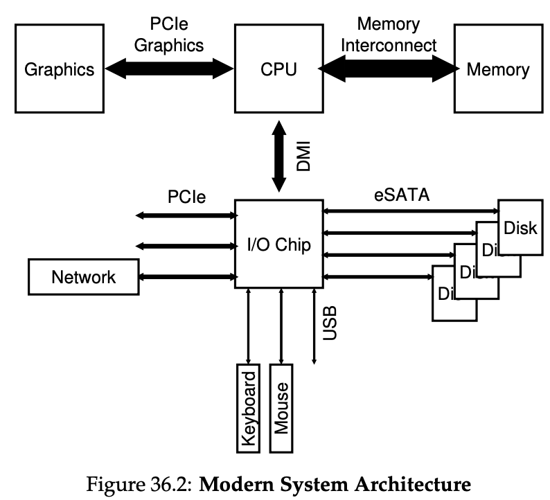

## Example of small device:

Status register will tell you current status of device. Command will tell the device to perform some kind of task. Data is to pass data to the device.

The while loop you see is called **polling** a device. 

## Interrupting instead of polling

After an I/O operation is finished, it will raise an interrupt so the calling process can go back to the READY state. So the CPU doesn’t have to poll the I/O device all the time. This allows overlap of computation and I/O.

Sometimes polling might work better than interrupting. For example if a device finishes it tasks really quickly, switching to another process, handling the interrupt, switching back to the issuing process will slow down the system.

Two-phase approach (polling for a little and if the device isnt finished using interrupts) works well too.

## Direct Memory Access (DMA)

The CPU would waste a lot of time transferring data to and from the device’s data register. Instead, there’s an engine that does this kind of work called the DMA: (diagram with process 1 and process 2 computation)

The OS programs the DMA engine telling it where the data lives in memory, how much data to copy, and which device to send it to. At that point, the OS is done with the transfer and can proceed with other work. 

When the DMA is complete, the DMA controller raises an interrupt, and the OS thus knows the transfer is complete.

## Device Driver

How does the OS know how a device works? With a piece of software called device driver, where the specifics of device interaction are encapsulated.

All of this is abstracted away then. Here’s an example for a file system and some storage devices.

This much abstraction actually has some downsides. For example the SCSI has better capabilities for error handling, but ASA/IDE don’t. Thereforet he interface loses that extra capability because it needs to be generic for all devices.